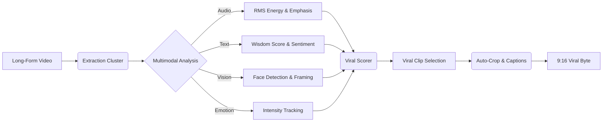

# 🎬 ByteSize Sage: The Wisdom Byte Extractor

Transform your long-form content into viral-ready "Wisdom Bytes" with one click. **ByteSize Sage** is an AI-powered pipeline that analyzes video, audio, and text to find the most impactful segments of your content and automatically formats them for TikTok, Reels, and YouTube Shorts.


---

## ⚡ The Value Proposition
Current video tools are either manual and tedious or generic and "black-box." **ByteSize Sage** is different. It uses a **multimodal intelligence engine** to understand *why* a clip is valuable—whether it's the speaker's emotional intensity, the density of wisdom in their words, or the visual clarity of their face.

- **Stop Guessing**: Let the data rank your clips by their "Viral Potential."
- **Total Control**: Adjust processing weights to favor humor, wisdom, or high-energy moments.
- **Privacy First**: High-performance local AI (OpenAI Whisper) means your content stays on your machine.

---

## 🧠 Multimodal Intelligence Flow
ByteSize Sage doesn't just listen; it perceives. It scores every second of your video across four distinct dimensions:



---

## 🚀 Feature Set
- **🎯 1-Click Viral Scoring**: Our custom algorithm ranks segments based on multimodal peaks.
- **📱 Smart Auto-Clipping**: Automatically crops to a vertical (9:16) aspect ratio, ensuring the subject stays centered.
- **🖍️ Stylized Captions**: Generates high-impact, TikTok-style overlays (Yellow/Black) out of the box.
- **📊 Real-Time Analytics**: Explore the "Viral Score Timeline" and see exactly where the "heat" is in your video.
- **🔗 Hybrid Input**: Paste a YouTube URL or upload raw files directly.

---

## 🛠️ Installation & Setup

### Requirements
- Python 3.9 - 3.11
- FFmpeg (for video processing)
- ImageMagick (for captioned overlays)

### Setup
1. **Clone & Enter**
   ```bash
   git clone https://github.com/Akkii88/BiteSize.git
   cd BiteSize
   ```

2. **Install Dependencies**
   ```bash
   pip install -r requirements.txt
   ```

3. **Launch the Engine**
   ```bash
   streamlit run app.py
   ```

### 🐳 Docker Support (Recommended)
Get up and running in a clean container environment:
```bash
docker build -t bitesize-sage .
docker run -p 8501:8501 bitesize-sage
```

---

## 🛸 Operational Guide
1. **Input**: Paste a YouTube link or drag-and-drop your `.mp4`.
2. **Tune**: Use the sidebar sliders to tell the AI what you value (e.g., more "Wisdom" vs more "Energy").
3. **Analyze**: Let the Sage traverse your content (Sub-second processing for local snippets).
4. **Export**: Preview the generated clips in the "Viral Clips" tab and download your favorites.

---

## ⚖️ Ethics & Open Source
This project is built for content creators who value autonomy. We don't believe in SaaS subscriptions for something your own hardware can do. 

*Developed with the goal of democratizing high-quality video production through AI.*
